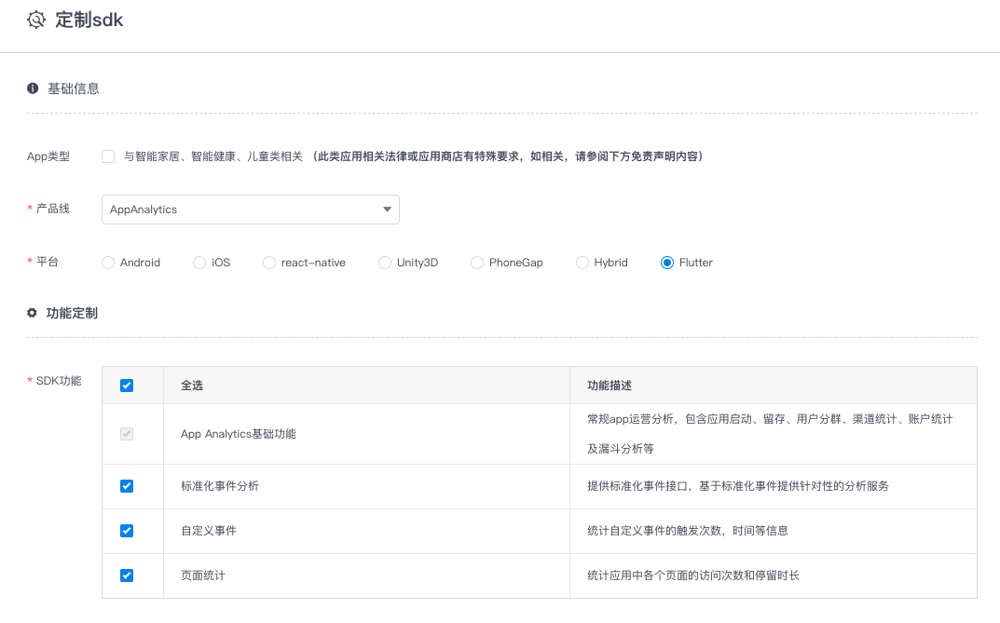
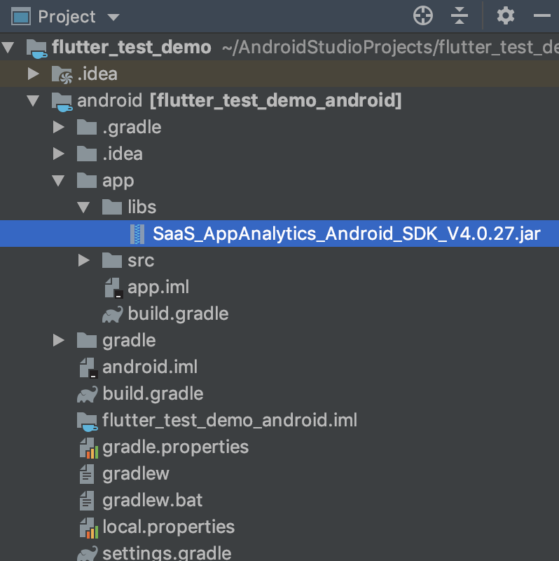

# flutter-talkingdata-appanalytics

App Analytics flutter 平台 SDK 由`封装层`和`Native SDK`两部分构成，目前Github上提供了封装层代码，需要从 [TalkingData官网](https://www.talkingdata.com/spa/sdk/#/config) 下载最新版的 Android 和 iOS 平台 Native SDK，组合使用。

## 目录

* [集成说明](#integration)
* [INSTALL & 安装](#install)
* [IMPORT &  引用](#usage)
* [API 说明](#api)

<span id="integration"/>

## 集成说明

1. 下载本项目（封装层）到本地；

2. 访问 [TalkingData官网](https://www.talkingdata.com/spa/sdk/#/config?productLine=AppAnalytics&sdkPlatform=react-native) 下载最新版的 Android 和 iOS 平台 App Analytics SDK（ Native SDK） 选择 flutter 平台进行功能定制；

   

3. 将下载的最新版 `Native SDK` 复制到`封装层`中，构成完整的 flutter SDK。
   - iOS 平台
     
     - 将最新的 .a 文件复制到 `ios` 目录下
   
4. 按 `Native SDK` 功能选项对`封装层`代码进行必要的删减，详见“注意事项”第2条；

5. 将flutter SDK 集成您需要统计的工程中，并按 [集成文档](http://doc.talkingdata.com/posts/848) 进行必要配置和功能调用。


### 注意事项

1. 分别选择 Android 和 iOS 平台进行功能定制时，请确保两个平台功能项一致。

2. 如果申请 Native SDK 时只选择了部分功能，则需要在本项目中删除未选择功能对应的封装层代码。

   a) 未选择`自定义事件`功能则删除以下4部分

   删除 `lib/talkingdata_appanalytics_plugin.dart` 文件中如下代码：

   ```dart
   static Future<void> onEvent({@required String eventID, String eventLabel, Map params}) async{
     ...
   }
   
   static Future<void> setGlobalKV(String key, Object value) async{
     ...
   }
   
   static Future<void> removeGlobalKV(String key) async{
     ...
   }
   ```

   删除 `android/src/main/java/com/talkingdata/plugin/appanalytics/TalkingDataAppAnalyticsPlugin.java` 文件中如下代码：

   ```java
   case "onEvent":
     String eventID = call.argument("eventID");
     String eventLabel = call.argument("eventLabel");
     Map params = null;
     if (call.argument("params") instanceof Map){
       params = call.argument("params");
     }
     TCAgent.onEvent(context, eventID, eventLabel, params);
     break;
   case "setGlobalKV":
     String globalKey = call.argument("key");
     Object globalValue = call.argument("value");
     TCAgent.setGlobalKV(globalKey, globalValue);
     break;
   case "removeGlobalKV":
     String key = call.argument("key");
     TCAgent.removeGlobalKV(key);
     break;
   ```

   删除 `ios/Classes/TalkingDataAppAnalyticsPlugin.m` 文件中如下代码：

   ```objective-c
   else if ([@"onEvent" isEqualToString:call.method]){
           NSString * eventID = [self checkArgument:call.arguments forKey:@"eventID" ofType:[NSString class]];
           NSString * eventLabel = [self checkArgument:call.arguments forKey:@"eventLabel" ofType:[NSString class]];
           NSDictionary * params = [self checkArgument:call.arguments forKey:@"params" ofType:[NSDictionary class]];
           if (eventID) {
               [TalkingData trackEvent:eventID label:eventLabel parameters:params];
           }
       }
   ...
   else if ([@"setGlobalKV" isEqualToString:call.method]) {
           NSString * key = [self checkArgument:call.arguments forKey:@"key" ofType:[NSString class]];
           id value = call.arguments[@"value"];
           if (value) {
               [TalkingData setGlobalKV:key value:value];
           }
       }else if ([@"removeGlobalKV" isEqualToString:call.method]){
           NSString * key = [self checkArgument:call.arguments forKey:@"key" ofType:[NSString class]];
           [TalkingData removeGlobalKV:key];
       }
   
   ```

   b) 未选择 `标准化事件分析` 功能则删除以下4部分

   删除 `lib/talkingdata_appanalytics_plugin.dart` 文件中如下代码:

   ```dart
   static Future<void> onPlaceOrder({String accountID, Order order}) async{
     ...
   }
   
   static Future<void> onOrderPaySucc({String accountID, String payType, Order order}) async{
     ...
   }
   
   static Future<void> onAddItemToShoppingCart({String itemId, String category, String name, int unitPrice, int amount}) async{
     ...
   }
   
   static Future<void> onViewItem({String itemId ,String category,String name,int unitPrice}) async{
     ...
   }
   
   static Future<void> onViewShoppingCart(ShoppingCart shoppingCart) async{
     ...
   }
   ...
     
   class Order{
     ...
   }
   
   class ShoppingCart{
     ...
   }
   ```

   删除 `android/src/main/java/com/talkingdata/plugin/appanalytics/TalkingDataAppAnalyticsPlugin.java` 文件中如下代码：

   ```java
   case "onPlaceOrder":
     TCAgent.onPlaceOrder(
             (String) call.argument("accountID"),
             getOrderFromFlutter(call)
     );
     break;
   case "onViewShoppingCart":
     ShoppingCart shoppingCart = ShoppingCart.createShoppingCart();
     List<Map> shoppingCartDetails = call.argument("shoppingCartDetails");
     for (int i = 0; i < shoppingCartDetails.size(); i++){
       Map map = shoppingCartDetails.get(i);
       shoppingCart.addItem(
               (String)map.get("itemID"),
               (String)map.get("category"),
               (String)map.get("name"),
               (int)map.get("unitPrice"),
               (int)map.get("amount")
       );
     }
   
     TCAgent.onViewShoppingCart(shoppingCart);
     break;
   case "onAddItemToShoppingCart":
     TCAgent.onAddItemToShoppingCart(
             (String) call.argument("itemID"),
             (String) call.argument("category"),
             (String) call.argument("name"),
             (int) call.argument("unitPrice"),
             (int) call.argument("amount")
     );
     break;
   case "onOrderPaySucc":
     TCAgent.onOrderPaySucc(
             (String) call.argument("accountID"),
             (String) call.argument("payType"),
             getOrderFromFlutter(call)
     );
     break;
   case "onViewItem":
     TCAgent.onViewItem(
             (String) call.argument("itemID"),
             (String) call.argument("category"),
             (String) call.argument("name"),
             (int) call.argument("unitPrice")
     );
     break;
   
   ...
     
   private Order getOrderFromFlutter(MethodCall call){
     ...
   }
   ```

   删除 `ios/Classes/TalkingDataAppAnalyticsPlugin.m` 文件中如下代码：

   ```objective-c
   else if ([@"onViewItem" isEqualToString:call.method]){
           NSString* category = [self checkArgument:call.arguments forKey:@"category" ofType:[NSString class]];
           NSString* itemID = [self checkArgument:call.arguments forKey:@"itemID" ofType:[NSString class]];
           NSString* name = [self checkArgument:call.arguments forKey:@"name" ofType:[NSString class]];
           NSNumber* unitPrice = [self checkArgument:call.arguments forKey:@"unitPrice" ofType:[NSNumber class]];
           [TalkingData onViewItem:itemID category:category name:name unitPrice:unitPrice.intValue];
           
       } else if ([@"onAddItemToShoppingCart" isEqualToString:call.method]){
           NSNumber * amount = [self checkArgument:call.arguments forKey:@"amount" ofType:[NSNumber class]];
           NSString * category = [self checkArgument:call.arguments forKey:@"category" ofType:[NSString class]];
           NSString * itemID = [self checkArgument:call.arguments forKey:@"itemID" ofType:[NSString class]];
           NSString * name = [self checkArgument:call.arguments forKey:@"name" ofType:[NSString class]];
           NSNumber * uniprice = [self checkArgument:call.arguments forKey:@"unitPrice" ofType:[NSNumber class]];
           [TalkingData onAddItemToShoppingCart:itemID category:category name:name unitPrice:uniprice.intValue amount:amount.intValue];
       } else if ([@"onViewShoppingCart" isEqualToString:call.method]){
           NSArray * shoppingCartDetails = [self checkArgument:call.arguments forKey:@"shoppingCartDetails" ofType:[NSArray class]];
           TalkingDataShoppingCart * sc = [TalkingDataShoppingCart createShoppingCart];
           for (NSDictionary* each in shoppingCartDetails) {
               NSNumber * amount = [self checkArgument:each forKey:@"amount" ofType:[NSNumber class]];
               NSString * category = [self checkArgument:each forKey:@"category" ofType:[NSString class]];
               NSString * itemID = [self checkArgument:each forKey:@"itemID" ofType:[NSString class]];
               NSString * name = [self checkArgument:each forKey:@"name" ofType:[NSString class]];
               NSNumber * uniprice = [self checkArgument:each forKey:@"unitPrice" ofType:[NSNumber class]];
               [sc addItem:itemID category:category name:name unitPrice:uniprice.intValue amount:amount.intValue];
           }
           [TalkingData onViewShoppingCart:sc];
       } else if ([@"onPlaceOrder" isEqualToString:call.method]){
           NSString * accountID = [self checkArgument:call.arguments forKey:@"accountID" ofType:[NSString class]];
           NSString * currencyType = [self checkArgument:call.arguments forKey:@"currencyType" ofType:[NSString class]];
           NSArray * orderDetails = [self checkArgument:call.arguments forKey:@"orderDetails" ofType:[NSArray class]];
           NSString * orderID = [self checkArgument:call.arguments forKey:@"orderID" ofType:[NSString class]];
           NSNumber * totalPrice = [self checkArgument:call.arguments forKey:@"totalPrice" ofType:[NSNumber class]];
           
           TalkingDataOrder * order = [TalkingDataOrder createOrder:orderID total:totalPrice.intValue currencyType:currencyType];
           
           for (NSDictionary * each in orderDetails) {
               NSNumber * amount = [self checkArgument:each forKey:@"amount" ofType:[NSNumber class]];
               NSString * category = [self checkArgument:each forKey:@"category" ofType:[NSString class]];
               NSString * itemID = [self checkArgument:each forKey:@"itemID" ofType:[NSString class]];
               NSString * name = [self checkArgument:each forKey:@"name" ofType:[NSString class]];
               NSNumber * uniprice = [self checkArgument:each forKey:@"unitPrice" ofType:[NSNumber class]];
               [order addItem:itemID category:category name:name unitPrice:uniprice.intValue amount:amount.intValue];
           }
           [TalkingData onPlaceOrder:accountID order:order];
           
       } else if ([@"onOrderPaySucc" isEqualToString:call.method]){
           NSString * accountID = [self checkArgument:call.arguments forKey:@"accountID" ofType:[NSString class]];
           NSString * currencyType = [self checkArgument:call.arguments forKey:@"currencyType" ofType:[NSString class]];
           NSArray * orderDetails = [self checkArgument:call.arguments forKey:@"orderDetails" ofType:[NSArray class]];
           NSString * orderID = [self checkArgument:call.arguments forKey:@"orderID" ofType:[NSString class]];
           NSString * payType = [self checkArgument:call.arguments forKey:@"payType" ofType:[NSString class]];
           NSNumber * totalPrice = [self checkArgument:call.arguments forKey:@"totalPrice" ofType:[NSNumber class]];
           
           TalkingDataOrder * order = [TalkingDataOrder createOrder:orderID total:totalPrice.intValue currencyType:currencyType];
           
           for (NSDictionary * each in orderDetails) {
               NSNumber * amount = [self checkArgument:each forKey:@"amount" ofType:[NSNumber class]];
               NSString * category = [self checkArgument:each forKey:@"category" ofType:[NSString class]];
               NSString * itemID = [self checkArgument:each forKey:@"itemID" ofType:[NSString class]];
               NSString * name = [self checkArgument:each forKey:@"name" ofType:[NSString class]];
               NSNumber * uniprice = [self checkArgument:each forKey:@"unitPrice" ofType:[NSNumber class]];
               [order addItem:itemID category:category name:name unitPrice:uniprice.intValue amount:amount.intValue];
           }
           [TalkingData onOrderPaySucc:accountID payType:payType order:order];
       }
   ```


    c) 未选择`页面统计`功能则删除以下4部分

   删除 `lib/talkingdata_appanalytics_plugin.dart` 文件中如下代码:

   ```dart
   static Future<void> onPageStart(String pageName) async{
     return await _channel.invokeMethod('onPageStart', <String, dynamic>{
       'pageName': pageName
     });
   }
   
   static Future<void> onPageEnd(String pageName) async{
     return await _channel.invokeMethod('onPageEnd', <String, dynamic>{
       'pageName': pageName
     });
   }
   ```

    删除 `android/src/main/java/com/talkingdata/plugin/appanalytics/TalkingDataAppAnalyticsPlugin.java` 文件中如下代码：

   ```java
   case "onPageStart":
     TCAgent.onPageStart(context, (String) call.argument("pageName"));
     break;
   case "onPageEnd":
     TCAgent.onPageEnd(context, (String) call.argument("pageName"));
   	break;
   ```

删除 `ios/Classes/TalkingDataAppAnalyticsPlugin.m` 文件中如下代码：

```objective-c
if ([@"onPageStart" isEqualToString:call.method]){
        NSString * pageName = [self checkArgument:call.arguments forKey:@"pageName" ofType:[NSString class]];
        if (pageName) {
            [TalkingData trackPageBegin:pageName];
        }
    } else if ([@"onPageEnd" isEqualToString:call.method]){
        NSString * pageName = [self checkArgument:call.arguments forKey:@"pageName" ofType:[NSString class]];
        if (pageName) {
            [TalkingData trackPageEnd:pageName];
        }
    } else 
```


<span id="install"/>

## INSTALL & 安装

**Android**

- 将最新的 .jar 文件复制到 flutter 项目的 `android/libs` 目录下

  
- 在`android/build.gradle`中添加对 jar 包的引用

  

**iOS**

1. 将

   `/Assets/libTalkingData.a`, 

   `Classes/TalkingData.h`

   `Classes/TalkingDataAppAnalyticsPlugin.h`,

   `Classes/TalkingDataAppAnalyticsPlugin.m` 

   copy到工程项目中，记得勾选copyIfNeeded。如下图

   


   


**Flutter**

- 把插件文件夹复制到 flutter 应用项目的根目录中。

   
   
- 在项目的 `pubspec.yaml` 文件中，添加如下配置

   ```diff
      dependencies:
        flutter:
          sdk: flutter
   +    talkingdata_appanalytics_plugin:
   +      path: 插件文件夹名(如：appanalytics)
   ```

<span id='usage'>

## IMPORT & 引用

**Android**

1. 在 Android Module 中的 Application 中添加 `import com.tendcloud.tenddata.TCAgent;`

2. 在 Application 的 onCreate 方法中添加 SDK 的初始化调用

   ```diff
   +  import com.tendcloud.tenddata.TCAgent;
        class MyApplication extends Application{
          @Override
          public void onCreate() {
            super.onCreate();
   +        TCAgent.init(getApplicationContext(), "Your App ID", "Channel ID");
          }
      }
   ```
   
3. 在 AndroidManifest.xml 中添加以下权限：

   ```diff
   <!--?xml version="1.0" encoding="utf-8"?-->
   <manifest ......>
   +  <uses-permission android:name="android.permission.INTERNET" /><!-- 允许程序联网和发送统计数据的权限。-->
   +  <uses-permission android:name="android.permission.ACCESS_NETWORK_STATE" /><!-- 允许应用检测网络连接状态，在网络异常状态下避免数据发送，节省流量和电量。-->
   +  <uses-permission android:name="android.permission.READ_PHONE_STATE"  /><!-- 允许应用以只读的方式访问手机设备的信息，通过获取的信息来唯一标识用户。-->
   +  <uses-permission android:name="android.permission.ACCESS_WIFI_STATE"  /><!-- 获取设备的MAC地址，同样用来标识唯一用户。-->
   +  <uses-permission android:name="android.permission.WRITE_EXTERNAL_STORAGE"  /><!-- 用于保存设备信息，以及记录日志。-->
   +  <uses-permission android:name="android.permission.GET_TASKS"  /><!-- (建议配置) 获取当前应用是否在显示应用，可以更精准的统计用户活跃-->
   +  <uses-permission android:name="android.permission.ACCESS_FINE_LOCATION"  /><!-- (可选权限) 可通过GPS获取设备的位置信息，用来修正用户的地域分布数据，使报表数据更准确。-->
   +  <uses-permission android:name="android.permission.ACCESS_COARSE_LOCATION"  /><!-- (可选权限) 用来获取该应用被使用的粗略位置信息。-->
   
     <application ......>
     <activity ......>
     ......
     </activity>
     ......
     </application>
   </manifest>
   ```


**iOS**

1. 在AppDelegate里添加如下代码，注意调用顺序

```diff
#include "AppDelegate.h"
#include "GeneratedPluginRegistrant.h"
+ #import "TalkingDataAppAnalyticsPlugin.h"
@implementation AppDelegate

- (BOOL)application:(UIApplication *)application
    didFinishLaunchingWithOptions:(NSDictionary *)launchOptions {
  [GeneratedPluginRegistrant registerWithRegistry:self];
  // Override point for customization after application launch.
   
+  [TalkingDataAppAnalyticsPlugin registerWithRegistrar:[self registrarForPlugin:@"TalkingDataAppAnalyticsPlugin"]];
    
+ [TalkingDataAppAnalyticsPlugin pluginSessionStart:@"YourAppKey" withChannelId:@"AppStore"];

  return [super application:application didFinishLaunchingWithOptions:launchOptions];
}

@end
```


**Flutter**

- 在需要调用 SDK API 的 dart 文件中添加

  ```dart
  import 'package:talkingdata_appanalytics_plugin/talkingdata_appanalytics_plugin.dart';
  ```
  
  然后即可调用 SDK 中相应的 API。

<span id="api"/>

## API 说明

**getDeviceID**

获取设备ID

**参数：**无

**示例：**

```dart
String deviceID;
_setDeviceID() async{
  deviceID =  await TalkingDataAppAnalytics.getDeviceID();
  //Print deviceID or dosomething
  print(deviceID);
}
```

---

**onPageStart**

触发页面事件，在页面加载完毕的时候调用，用于记录页面名称和使用时长，和 `onPageEnd` 配合使用

**参数：**

| 名称     | 类型   | 说明     |
| :------- | ------ | -------- |
| pageName | String | 页面名称 |

**示例：**

```dart
TalkingDataAppAnalytics.onPageStart('Page Test');
```

---

**onPageEnd**

触发页面事件，在页面消失的时候调用，用于记录页面名称和使用时长，和 `onPageStart` 配合使用

**参数：**

| 名称     | 类型   | 说明     |
| :------- | ------ | -------- |
| pageName | String | 页面名称 |

**示例：**

```dart
TalkingDataAppAnalytics.onPageEnd('Page Test');
```

------

**onEvent**

自定义事件用于追踪任何需要了解的用户行为，如：用户点击某功能按钮、填写某个输入框、触发了某个广告等。

**参数：**

| 名称       | 类型   | 说明     |
| :--------- | ------ | -------- |
| eventID    | String | 事件名称 |
| eventLabel | String | 事件标签 |
| params     | Map    | 事件参数 |

**示例：**

```dart
Map map = {};
map['key1'] = 'value1';
map['key2'] = 'value2';
TalkingDataAppAnalytics.onEvent(
      eventID: 'TestEventID',
      eventLabel: 'TestEventLabel',
      params: map
);
```

------

**setGlobalKV**

设置自定义事件全局的key,value

**参数：**

| 名称  | 类型   | 说明        |
| :---- | ------ | ----------- |
| key   | String | 全局的key   |
| value | Object | 全局的value |

**示例：**

```dart
TalkingDataAppAnalytics.setGlobalKV('keyXXX','valueXXX');
TalkingDataAppAnalytics.setGlobalKV('keyXXX',12221);
```

------

**removeGlobalKV**

移除自定义事件全局的key,value

**参数：**

| 名称 | 类型   | 说明      |
| :--- | ------ | --------- |
| key  | String | 全局的key |

**示例：**

```dart
TalkingDataAppAnalytics.removeGlobalKV('keyXXX');
```

------

**onRegister**

注册接口用于记录用户在使用应用过程中的注册行为。建议在注册成功时调用此接口。

**参数：**

| 名称        | 类型        | 说明     |
| :---------- | ----------- | -------- |
| accountID   | String      | 账户ID   |
| accountType | AccountType | 账户类型 |
| name        | String      | 账户昵称 |

**示例：**

```dart
TalkingDataAppAnalytics.onRegister(
   accountID: 'TestAccountID',
   accountType: AccountType.WEIXIN,
   name: 'testName'
);
```

------

**onLogin**

登录接口用于记录用户在使用应用过程中的登录行为。

**参数：**

| 名称        | 类型        | 说明     |
| :---------- | ----------- | -------- |
| accountID   | String      | 账户ID   |
| accountType | AccountType | 账户类型 |
| name        | String      | 账户昵称 |

**示例：**

```dart
TalkingDataAppAnalytics.onLogin(
   accountID: 'TestAccountID',
   accountType: AccountType.WEIXIN,
   name: 'testName'
);
```

------

**onPlaceOrder**

下单接口用于记录用户在使用应用过程中的成功下单的行为。 下单接口由3个子接口构成：创建订单、添加订单详情、成功下单。

**参数：**

| 名称      | 类型   | 说明   |
| :-------- | ------ | ------ |
| accountID | String | 账户ID |
| order     | Order  | 订单   |

**示例：**

```dart
Order order = Order(
  orderID: 'testOrderID',	//订单ID
  totalPrice: 1,					//总价格
  currencyType: 'CNY',		//货币类型
);
order.addItem(
  'testID', 							//商品ID
  'Food', 								//商品类别
  'apple', 								//商品名称
  22, 										//商品单价
  33);										//商品数量
TalkingDataAppAnalytics.onPlaceOrder(
  accountID: 'testAccount',
  order: order
);
```

------

**onOrderPaySucc**

成功支付订单接口用于记录用户完成订单支付的行为。

**参数：**

| 名称      | 类型   | 说明     |
| :-------- | ------ | -------- |
| accountID | String | 账户ID   |
| payType   | String | 支付方式 |
| order     | Order  | 订单     |

**示例：**

```dart
Order order = Order(
  orderID: 'testOrderID',	//订单ID
  totalPrice: 1,					//总价格
  currencyType: 'CNY',		//货币类型
);
order.addItem(
  'testID', 							//商品ID
  'Food', 								//商品类别
  'apple', 								//商品名称
  22, 										//商品单价
  33);										//商品数量
TalkingDataAppAnalytics.onOrderPaySucc(
  accountID: 'testAccount',
  payType: 'Alipay',
  order: order
);
```

------

**onAddItemToShoppingCart**

用于记录用户将商品加入购物车的行为。

**参数：**

| 名称      | 类型   | 说明     |
| :-------- | ------ | -------- |
| itemId    | String | 商品ID   |
| category  | String | 商品类别 |
| name      | String | 商品名称 |
| unitPrice | int    | 商品单价 |
| amount    | int    | 商品数量 |

**示例：**

```dart
TalkingDataAppAnalytics.onAddItemToShoppingCart(
  itemId: 'itemID331135516',
  category: 'Food',
  name: 'apple',
  unitPrice: 22,
  amount: 33
);
```

------

**onViewItem**

用于描述用户查看商品详情的行为。

**参数：**

| 名称      | 类型   | 说明     |
| :-------- | ------ | -------- |
| itemId    | String | 商品ID   |
| category  | String | 商品类别 |
| name      | String | 商品名称 |
| unitPrice | int    | 商品单价 |

**示例：**

```dart
TalkingDataAppAnalytics.onViewItem(
  itemId: 'itemID331135516',
  category: 'Food',
  name: 'apple',
  unitPrice: 44
);
```

------

**onViewShoppingCart**

用于描述用户查看商品详情的行为。

**参数：**

| 名称         | 类型         | 说明       |
| :----------- | ------------ | ---------- |
| shoppingCart | ShoppingCart | 购物车信息 |

**示例：**

```dart
ShoppingCart shoppingCart = ShoppingCart();
shoppingCart.addItem(
  'itemID331135516', 		//商品ID
  'Food', 							//商品类别
  'apple', 							//商品名称
  33, 									//商品单价
  11										//商品数量
);
shoppingCart.addItem('itemID333103428', 'Food', 'banana', 777, 888);
TalkingDataAppAnalytics.onViewShoppingCart(shoppingCart);

```

------

## 运行Demo

连接真机。终端运行：

```shell
cd sdk-talkingdata-sdk-flutter-plugin/example
flutter run
```

